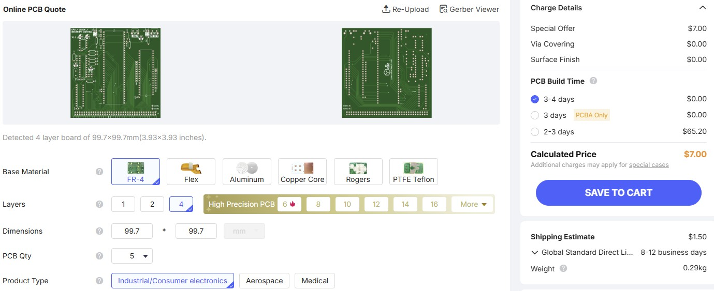
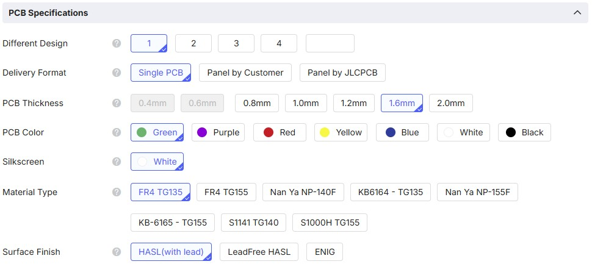
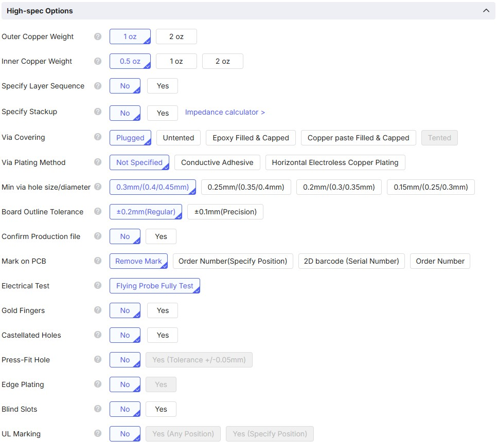

# Description

These .zip files contain pre-generated PCB files for each of the `TI CUBE` boards in Gerber format, so you do not have to be familiar with KiCad to construct your project. Instead these can be directly uploaded to your favourite PCB house for manufacturing. Personally, I have had excellent results using [jlcpcb.com](https://jlcpcb.com) on multiple projects. If you do decide to order PCBs for them use of my [referral code](https://jlcpcb.com/?from=VPVBXXNT) would be appreciated.

# Instructions

Simply upload the appropriate Gerber .zip file to your PCB manufacturer website. It should automatically decode the contents and display something like the following:

# Additional PCB Settings

All other settings can be left at the default as shown below.

